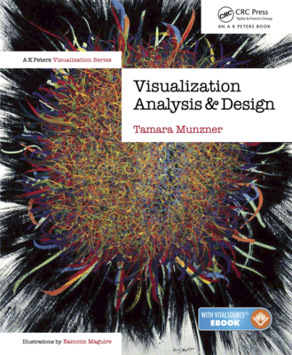

# Visualización de Información

**¡Bienvenide a mi curso introductorio de Visualización de Información!** En esta página encontrarás todo el material teórico y práctico que tengo disponible.

Este curso tiene los siguientes objetivos:

1.  Adquirir un lenguaje común y un entendimiento fundamental dentro del campo visualización de información.
2.  Ser capaces de **diseñar** una visualización de datos efectiva para el problema a resolver.
3.  Ser capaces de **evaluar** una visualización con espíritu crítico.
4.  Aprender a prototipar e implementar visualizaciones en Python.

Cumplir estos objetivos requiere las siguientes capacidades ya desarrolladas en les estudiantes:

1.  Python intermedio: a nivel de programación (control de flujo, definición de funciones, estructuras de datos, funciones lambda) y de manejo de herramientas (conda environments, Jupyter Lab).
2.  Conocimiento básico de pandas y sus operaciones, incluyendo filtros y operaciones como groupby. Se espera que hayan cursado (o estén cursando) una asignatura de _análisis de datos_.
3.  Aunque el material del curso está en castellano, gran parte de los recursos bibliográficos y de código externo están disponibles solo en inglés.

Los siguientes links son relevantes para quienes hacen el curso formalmente:

*   [Instrucciones y evaluación de proyecto de curso](markdowns/rubrica-proyecto)
*   [Algunos links a Datasets para proyectos](markdowns/resources)
*   [Muestra de Visualizaciones](markdowns/showcase)

## Unidades Teóricas 

1.  **Introducción** a la Visualización [📖 Monografía](markdowns/clase_01.md). [🖥️ Slides](https://docs.google.com/presentation/d/1IUe26BpVOzEaQnPNwXaR62rxbpKvOBp1kwUtYhOC00A/edit?usp=sharing).
2.  **¿Qué visualizar?** Abstracción de Datos [📖 Monografía](markdowns/clase_02.md). [🖥️ Slides](https://docs.google.com/presentation/d/11gqcGFSjfiEtOrqOfYwYtnmyaUY_FsftoICScHOTwWE/edit?usp=sharing).
3.  **¿Para qué visualizar?** Abstracción de Tareas [📖 Monografía](markdowns/clase_03.md). [🖥️ Slides](https://docs.google.com/presentation/d/1mDPP6VliSj_16i6CPzLmANIqxlEcF2HAGAg46u0LoO4/edit?usp=sharing).
4.  **¿Cómo visualizar?** Codificación Visual [📖 Monografía](markdowns/clase_04.md). [🖥️ Slides](https://docs.google.com/presentation/d/1JZu7qxX0ozFjLlV0Z-Q5a1ZXM4bQIRGfC1qyvKFQOgo/edit?usp=sharing).
5.  Visualización de **Tablas** [📖 Monografía](markdowns/clase_05.md). [🖥️ Slides](https://docs.google.com/presentation/d/1ibRpdMGI6HJWpzMzTsIVyRN89ZT6wIS1VZpM6yR3_Wk/edit?usp=sharing).
6.  Visualización de **Datos Geográficos y Espaciales** [📖 Monografía](markdowns/clase_06.md). [🖥️ Slides](https://docs.google.com/presentation/d/1qBhJVLHIZxmHKS9rVicfFiu4NtHvH77mycg1ed-UpIU/edit?usp=sharing).
7.  Visualización de **Redes y Árboles** [📖 Monografía](markdowns/clase_07.md). [🖥️ Slides](https://docs.google.com/presentation/d/1nX9hoMnfW7hOkIcUR41zQVr1k9EtyE8rK9wbL2evUnw/edit?usp=sharing).
8.  **Colores** e Ilusiones [📖 Monografía](markdowns/clase_08.md). [🖥️ Slides](https://docs.google.com/presentation/d/1h13vUj1QnLqQYgxM2i-R1rTbrdE-hA-a0lU1iRq2cUY/edit?usp=sharing).
9.  **Buenas Prácticas** y **Evaluación** [📖 Monografía](markdowns/clase_09.md). [🖥️ Slides](https://docs.google.com/presentation/d/1Fn8ZyGWPM3BLiN6YjxtukXNZ-ootQ1uQ1gvLZf9UpOg/edit?usp=sharing).
10.  Visualización de **Texto** [📖 Monografía](markdowns/clase_10.md). [🖥️ Slides](https://docs.google.com/presentation/d/1bgKoK5QyMu4n8yR10ZNVwBlxwakaetYic6WbSuy2rIw/edit?usp=sharing).
11.  **Reducción de Complejidad** [📖 Monografía](markdowns/clase_11.md). [🖥️ Slides](https://docs.google.com/presentation/d/1BTZ3aPADa14hzv2zihV_dMRfz8sthvLafYM664JT11s/edit?usp=sharing).

## Unidades Prácticas 

Estas unidades utilizan el módulo [aves](https://github.com/zorzalerrante/aves) y la Encuesta Origen-Destino de Santiago 2012 (disponible en el repositorio de aves).
Los siguientes notebooks de Jupyter están en el repositorio de aves. Incluyo un link al repositorio y en algunos casos un link que te permite ejecutarlo en Google Colab:

1. [Introducción: Encuesta Origen-Destino + Python](notebooks/vis-course/01-python-tools.ipynb) 
2. [Visualización: Tablas](notebooks/vis-course/02-python-tablas.ipynb) 
3. [Datos Geográficos: Operaciones en geopandas](notebooks/vis-course/03-python-mapas-preliminario.ipynb) 
4. [Datos Geográficos: dot\_map, bubble\_map, heat\_map, choropleth\_map](notebooks/vis-course/03-python-mapas.ipynb) 
5. [Redes: Operaciones en graph-tool, visualización: node\_link, hierarchical\_edge\_bundling](notebooks/vis-course/04-python-redes-preliminario.ipynb) 
6. [Redes: Redes Geográficas](notebooks/vis-course/05-python-redes-eod.ipynb) 
7. [Texto: streamgraph, bubble\_cloud](notebooks/vis-course/06-python-texto-guaguas.ipynb) 

**Extra**: [Mini-taller de análisis de encuesta CASEN y resultados de elecciones presidenciales 2021](notebooks/talleres/extra-00-data-cleaning-casen.ipynb) 

## Bibliografía 

La parte teórica del curso se basa en estos dos libros:

*   **[Visualization Analysis & Design](http://www.cs.ubc.ca/~tmm/vadbook/)**, de Tamara Munzner.
*   **How Charts Lie**, de Alberto Cairo.

Los siguientes son libros complementarios:

*   **The Functional Art**, de Alberto Cairo.
*   **Design for Information**, de Isabel Meirelles.

## Créditos y Agradecimientos 

Este curso incluye material del libro [Visualization Analysis & Design de **Tamara Munzner**](http://www.cs.ubc.ca/~tmm/vadbook/) y de las presentaciones de su curso de visualización. ¡Gracias, Tamara!

