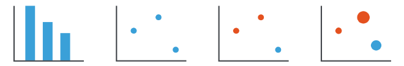
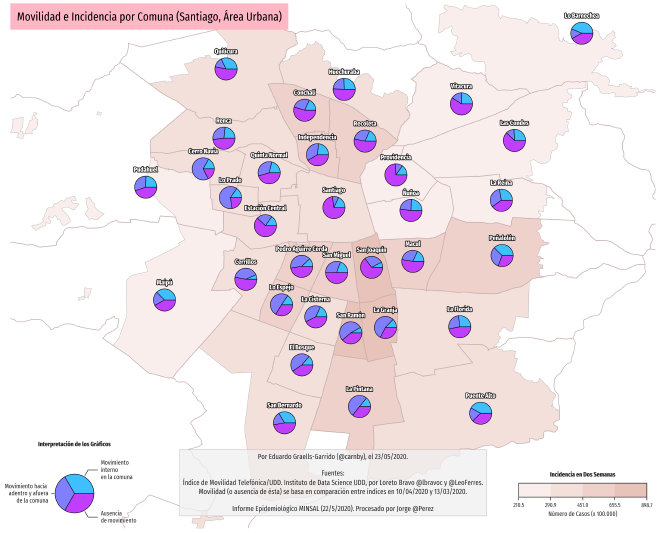

# ¿Cómo visualizar? Codificación Visual

A partir de ahora el curso se enfocará en el diseño e implementación de visualizaciones. Hay cuatro aspectos de diseño en una visualización: **codificación**, **manipulación**, **facetamiento**, **reducción**.

En esta unidad nos enfocaremos en la codificación, que, siguiendo las temáticas de las unidades anteriores, puede ser interpretada como **abstracción visual**. Los otros aspectos los definiremos en unidades posteriores de manera transversal, puesto que aparecen al trabajar en nuestros proyectos y al definir técnicas de visualización.

¿Cómo visualizar? Diseñando una solución en cuatro aspectos: codificación, manipulación, facetamiento y reducción. Fuente: Visualization Analysis & Design.

Lo que buscamos con la abstracción visual es llevar las observaciones y atributos relevantes y útiles de nuestros datasets a una representación gráfica que nos permita resolver las tareas que hemos definido. Sin embargo, en esta unidad la definición de abstracción es ligeramente distinta a la de las unidades anteriores, porque antes existía una traducción directa desde lo que contenían los datos y su organización hasta la definicińo de tipos y atributos. Lo mismo para la definición de tareas, a partir de una pregunta era posible convertirla en un par acción `+` objectivo. En cambio, ahora tenemos al menos dos pasos de codificación: primero, organizar las observaciones del dataset en el espacio visual (_arrange_); segundo, definir como los atributos de las observaciones definen sus propiedades visuales (_map_). En ese proceso deberemos tomar decisiones que habiliten el desarrollo de la tarea propuesta de manera óptima.

Aquí veremos que la manera de tomar esas decisiones se basa en dos principios: el **principio de efectividad** y el **principio de expresividad**. Veremos, también, como se determinó la teoría que nos permite tomar decisiones que respeten esos principios. El primer paso para ello es elegir una codificación visual correcta.

Antes de sumergirnos en los conceptos de la codificación visual, haremos un ejercicio. En este punto, es probable que todes hayamos estados expuestes a realizar gráficos de algún modo, al ser éste un curso de postgrado. Entonces aprovecharemos eso para ejemplificar el proceso de codificación visual a partir de nuestras propias experiencias.

## Ejercicio: Venta de Autos Usados 

Supongamos que somos diseñadores de visualización y un nuevo negocio de venta de autos usados nos ha contactado. La nueva dueña de este negocio quiere utilizar los datos que tiene del dueño anterior para entender y mejorar su desempeño financiero.

Los datos son los siguientes:

| Modelo de Auto | Millas Recorridas | Precio de Venta (USD) |
|----------------|------------------:|----------------------:|
| Accord         |                26 |                  5700 |
| AMC Pacer      |                16 |                  4800 |
| Audi 5000      |                16 |                  9800 |
| BMW 320i       |                26 |                 10000 |
| Champ          |                32 |                  4500 |
| Chev Nova      |                19 |                  4000 |
| Civic          |                28 |                  4500 |
| Datsun 210     |                33 |                  4700 |
| Datsun 810     |                22 |                  8200 |
| Deville        |                13 |                 11250 |
| Le Car         |                25 |                  3750 |
| Linc Cont      |                12 |                 11500 |
| Horizon        |                24 |                  4700 |
| Mustang        |                21 |                  4250 |
| Peugeot        |                13 |                 13250 |
| Saab 9000      |                21 |                  5500 |
| Subaru         |                35 |                  3600 |
| Volvo 260      |                16 |                 11990 |
| VW Dasher      |                22 |                  7250 |

El ejercicio consiste en:

1.  Determinar una tarea a resolver con los datos.
2.  Diseñar una visualización para resolver la tarea.

Es suficiente con hacerlo en una hoja de papel. Les pido que le saquen una foto a la hoja en la cual resuelvan el problema, para que la veamos en la clase mediante Zoom.

Los datos provienen del artículo _Automating the Design of Graphical Presentations of Relational Information_ de Mackinlay, 1986.

Discutiremos soluciones para este problema después de la siguiente sección.

## Codificación Visual y Principios de Diseño 

La codificacioń visual es el proceso en el que asignamos propiedades gráficas (formas, colores) a los atributos de nuestros datos. Este proceso se hace a través de **marcas** y **canales**.

Marcas (barras, círculos) y Canales (eje x, eje y, tamaño, color). Fuente: Visualization Analysis & Design.

Las marcas (_marks_) son primitivas geométricas que sirven de bloques de construcción de elementos gráficos. Ejemplos incluyen puntos, líneas y áreas:

Primitivas básicas que definen marcas. Fuente: Visualization Analysis & Design.

Los canales controlan la apariencia de las marcas. Existen canales de _posición_, de _forma_, de _tamaño_, de _color_, de _inclinación_, de _volumen_:

Canales básicos. Fuente: Visualization Analysis & Design.

Los canales pueden ser combinados e incluso ser redundantes. Interactúan con las marcas, es decir, el tipo de marca determina los canales que se pueden utilizar con ella. Por ejemplo, un punto solamente tiene posición (es 0D), pero puede tener un tamaño (en el gráfico) o una forma específica (por ej., un triángulo en vez de un círculo). No puede tener inclinación.

El concepto de marcas y canales en la codificación visual fue propuesto por Jacques Bertin en 1967, en su libro Sémiologie Graphique (La Semiología de los Gráficos):

Fuente: The Semiology of Graphics.

Como ven, la imagen incluso propone la separación de canales para datos ordinales (O) y cuantitativos (Q). El trabajo de Bertin ha generado un legado innegable. La popular biblioteca `ggplot` de R está basada en los conceptos propuestos por Bertin.

Continuemos. Podemos separar los canales en dos categorías: aquellos que expresan _magnitud_ y aquellos que expresan _identidad_. Los canales de magnitud se aplican a atributos ordinales o cuantitativos; los de identidad, a atributos categóricos.

Una vez que tenemos una tarea a resolver con datos, debemos elegir las marcas que utilizaremos para representar gráficamente los datos, así como los canales adecuados para que la resolución de la tarea sea óptima. La elección de marcas, y sobretodo de canales, será crucial en lograr ese objetivo. Pero, ¿cómo se hace?

En la literatura actual existe un ranking de efectividad de canales, de modo que podemos elegir los mejores canales disponibles para los distintos atributos que necesitemos representar en la visualización. Este ranking es el siguiente (los mejores canales están en la parte superior de la imagen):

Ranking de canales para magnitud (izquierda) e identidad (derecha). Los mejores canales aparecen en la parte superior. Fuente: Visualization Analysis & Design.

El ranking define que el mejor canal para expresar magnitud es la _posición en una escala común_. Eso significa que si tenemos dos ejes ortogonales (como suele suceder en los gráficos estadísticos), y tenemos dos posiciones distintas para una marca (que puede ser un punto), deterimar cuál marca está más arriba/abajo/izquierda/derecha es eficiente. Cuando la escala no es común, es decir, cuando los ejes no son iguales para distintas marcas (por ejemplo, ¡existen gráficos que tienen dos ejes y!), la comparación se vuelve más difícil.

Otro canal efectivo para medir y comparar magnitudes es el _largo_. Por ejemplo, saber cuál de dos barras es más larga y por cuanto (¿el doble?¿el triple?) es una operación eficiente y directa de hacer. En cambio, saber por cuánto es más grande una área (como un círculo o un cuadrado) que otra es más difícil: sabemos que es más grande, pero no por cuánto.

Algo similar sucede con los colores. Utilizar la _luminancia_ (cantidad de luz o blanco en un color) o la _saturación_ (intensidad del color) nos permite saber si un color es maś oscuro o más intenso, pero no por cuánto. Entonces, si nuestra tarea requiere determinar la diferencia en magnitudes, no es un buen canal. Si nuestra tarea requiere determinar el orden o _ranking_, entonces es un canal aceptable (pero siguen siendo mejores los otros canales ya mencionados).

Respecto a los canales de identidad, el mejor canal es la _posición en el espacio_. Si organizamos una biblioteca de modo que todos los libros de ficción estén en el anaquel de arriba y los libros académicos en el anaquel de abajo, como observadores notamos enseguida esa separación, y tendemos a asumir que es categórica, sin necesidad de que la altura del anaquel tenga significado.

El segundo atributo de identidad es la _tonalidad_ (_hue_) del color. La tonalidad nos permite separar categorías. ¡Por eso suele ser un error utilizar una escala de colores de arcoiris con valores cuantitativos! Porque no es un canal efectivo para ello, sin mencionar otros problemas, que analizaremos en la clase de colores.

El peor canal para identidad es la _forma_. Es común en un gráfico de dispersión (_scatterplot_) que se utilice la forma para identificar categorías distintas. De acuerdo a este ranking de canales, no es la mejor opción — pero a veces también debemos tomar esas decisiones porque hay que balancear otros aspectos. Un scatterplot ya utiliza los canales de posición x e y para _organizar_ las marcas, por tanto, el canal de región espacial no está disponible. Y si estamos trabajando en una visualización que será impresa, tendremos que asegurarnos de que incluso en blanco y negro se vea bien.

Noten que no he comentado todos los canales porque solo me he enfocado en los más frecuentes. Dejo el resto para su reflexión personal.

Ya tenemos marcas y canales a disposición para crear visualizaciones. Estamos en posición de definir los principios de efectividad y expresividad:

| Efectividad                                                                          | Expresividad                                                                                                                           |
|--------------------------------------------------------------------------------------|----------------------------------------------------------------------------------------------------------------------------------------|
| “Codificar los atributos más importantes de los datos con los canales más efectivos” | “Debe haber coherencia entre el tipo de canal (magnitud, identidad) con la semántica del atributo (cuantitativo, ordinal, categórico)” |

El principio de efectividad implica que debemos elegir el mejor canal disponible en cada decisión que tomemos. El principio de expresividad implica que si usamos un canal de identidad para magnitud, estaremos cometiendo un error. Así, si seguimos estos principios a la hora de diseñar una visualización, aseguraremos un desempeño óptimo en la resolución de la tarea.

Por supuesto, una visualización puede funcionar si no se respetan estos principios. Pero para romper las reglas es necesario dominarlas primero, de modo que logremos identificar cuándo las reglas nos limitan tanto que la solución que lleguemos solo sea un óptimo local.

## Posibles Soluciones al Ejercicio (de muchas)

Retomemos el ejercicio de venta de autos usados, viendo dos posibles soluciones del problema. Noten que existen tantas soluciones como tareas podamos definir para esos datos.

**Solución 1**: El negocio necesita desarrollar una estrategia de compra/venta. Para ello, ha determinado que respnder “¿existe relación entre el kilometraje (o millaje en este caso) de un automóvil y su precio de venta?” permitiría elegir mejor los automóviles de sus transacciones.

Primero, convertimos la pregunta a una tarea: `identificar correlación entre dos atributos`. Luego procedemos a la codificación visual: los dos atributos que tenemos son cuantitativos, y tenemos dos canales libres: `posición en una misma escala (eje x y eje y)`. Entonces, usaremos un `scatterplot`.

El resultado se ve así:

Fuente: Mackinlay, Automating the Design of Graphical Presentations of Relational Information.

¡La correlación es evidente! Sin embargo, no tenemos detalles sobre cada auto específico. Agregar etiquetas haría el gráfico más difícil de leer, puesto que éstas podrían ocultar la relación al llenar la visualización con texto.

**Solución 2**: El negocio acaba de empezar y todavía no domina del todo el inventario que tiene. ¿Cuál es el inventario completo? Si conociese la respuesta podría elegir mejor los automóviles a comprar (para vender).

La tarea consiste en `descubrir la distribución de cada atributo`. Como son dos atributos, necesitamos dos gráficos. Como tenemos un solo atributo cuantitativo en cada tarea, podemos utilizar el canal `posición en una misma escala (eje x)`. Como marca utilizaremos `barras`, aunque también podrían ser puntos. Como en el eje y agregaremos las etiquetas de cada auto, las barras nos facilitarán asociar una marca gráfica a una marca de auto.

El resultado se ve así:

Fuente: Mackinlay, Automating the Design of Graphical Presentations of Relational Information.

Con esta visualización es directo descubrir una aproximación de la distribución de cada atributo. Podemos conocer sus extremos, los que están en medio, y los que están sobre o bajo la media. Si a la tienda le quieren vender un Peugeot caro y con mucho kilometraje, con esta visualización una persona puede descartar inmediatamente una compra por parte del negocio: los Peugeot se venden caros, pero ya tenemos uno con bajo kilometraje, no tiene sentido comprar un auto peor. ¿Qué más observan en esta visualización?

Una limitación de esta segunda solución es que perdemos la relación entre atributos. Una manera de resolver ese aspecto es ordenando los autos de acuerdo al valor de algún atributo, pero eso vuelve difícil la búsqueda de una marca de auto específica, al perder el orden alfabético. Como ven, **siempre hay trade-offs**. Es parte del juego. Los aspectos de interactividad y facetamiento nos permiten disminuir esas decisiones difíciles y potenciar la funcionalidad, a costa de un mayor costo de implementación y de complejidad de uso.

## ¿Cómo se determina cuando un canal es más efectivo que otro? 

La efectividad (o falta de esta) de los canales se deterimna a partir de estudios miden la precisión, discriminabilidad, separabilidad, saliencia y relatividad de los canales. Definiremos estos conceptos a continuacioń.

Este tipo de estudios no es exclusivo de la visualización. El cómo percibimos los estímulos es una rama propia de la _psicofísica_. En esta área existen diversas leyes empíricas relacionadas con la intensidad de los estímulos y nuestra percepción sobre éstos. Una ley de percepción vigente (en tanto es aceptada) es la [Ley de Stevens](https://en.wikipedia.org/wiki/Stevens%27s_power_law). Stanley Smith Stevens publicó en 1957 su ley, que postula que el cuerpo humano rige la percepción de los estímulos utilizando una ley de potencias, y que distintos estímulos configuran distintos exponentes en esta ecuación. La siguiente imagen ilustra las curvas exponenciales (y sus exponentes) de algunos estímulos, resultados de experimentos de Stevens:

_Ley de Stevens_ sobre percepción de estímulos. Fuente: Visualization Analysis & Design.

En sus experimentos, Stevens midió la variación en la percepción de los estímulos. Simplificando, imaginen que les muestro una línea que mide 1 metro, y luego una que mide 2 metros. Si les pregunto cuál es la proporción entre ambas líneas, la respuesta será “el doble.” Eso significa que la relación entre cambio en el estímulo y cambio en la percepción es 1 a 1. Por eso el exponente del estímulo _largo_ (_length_) es 1. El exponente del estímulo _área_ es 0.7, es decir, si un cuadrado tiene el doble de área que otro, nosotres tendemos a percibir que el aumento es menor al real.

Stevens hizo muchos experimentos en los que midió estímulos de todo tipo. Eso incluye la percepción de lo salado, de lo dulce, e incluso del dolor. En el gráfico vemos que el _shock eléctrico_ tiene un exponente de 3.5. Eso significa que si comparamos dos golpes de corriente, un pequeño incremento en la intensidad del segundo golpe se sentirá como una gran diferencia. La [página de Wikipedia sobre la ley](https://en.wikipedia.org/wiki/Stevens%27s_power_law) contiene todos los estímulos medidos por Stevens.

Los pioneros en visualización estadística Cleveland y McGill hicieron estudios en 1984 (el título del paper es _Graphical Perception: Theory, Experimentation, and Application to the Development of Graphical Methods_, en la revista de la American Statistical Association) en el que hicieron experimentos de percepción para medir cuales visualizaciones eran más **precisas**. Una manera simple de describir estos experimentos es que se les muestran visualizaciones a distintas personas con las que se les pide que resuelvan tareas numéricas. Al ser numéricas, es posible medir el error en la ejecución de la tarea. Por tanto, se pueden ordenar las visualizaciones de acuerdo a su precisión general.

Heer y Bostock (otros pioneros, pero de la visualización moderna) utilizaron Mechanical Turk para extender el experimento de Cleveland y McGill. Mechanical Turk es un sitio de _crowdsourcing_, en el que se conectan personas de todo el mundo para ejecutar tareas a través de la pantalla de sus computadores. Las tareas pueden ser de todo tipo, por lo que Heer y Bostock aprovecharon de poner a prueba el método de evaluación, esta vez de manera distribuida y a escala, puesto que se pueden obtener cientos de respuestas en poco tiempo. Los resultados se muestran a continuación:

Fuente: Heer & Bostock, Crowdsourcing Graphical Perception: Using Mechanical Turk to Assess Visualization Design.

El experimento en Mechanical Turk comparó las mismas visualizaciones que el experimento original, más otras — ¡algunas incluso no existían cuando Cleveland y McGill definieron su estudio! La imagen nos muestra cuáles son los canales que se comparan en cada visualizacioń (izquierda), así como el error promedio y su variación (derecha). El gráfico que mejor se desempeña es el `barchart`.

El siguiente concepto es la **discriminabilidad**. Se refiere a la siguiente pregunta: ¿cuánto podemos distinguir un valor de otro de acuerdo a la codificación visual empleada? Un ejemplo concreto es ¿cuántos colores puedo distinguir?

Observemos el siguiente mapa:

Flujo de tráfico en la red de telefónica entre países de Europa a fines de los 90. Fuente: Mappa Mundi Magazine.

En el [mapa](https://mappa.mundi.net/maps/maps_014/index.html#telegeography) se muestra el flujo de llamadas telefónicas entre países (una `red`), medido en millones de minutos (el período de medición no está claro en la fuente del mapa). El grosor de cada línea codifica el tamaño del flujo entre un país y otro. Al ver la leyenda, notamos que existen solamente tres tipos de flujo (pequeño, medio y grande). ¿Lo habían notado?¿Si fuesen cinco tipos de flujo, ¿podrían distinguir el tercero del cuarto?¿Y si fuesen diez? Probablemente no podríamos diferenciarlos.

Otros conceptos importantes son la **separabilidad** e **integridad** de los canales. Ambos conceptos se refieren a la cualidad de los canales de ser percibidos de manera independiente (ser separables) o como un todo (estar integrados). Veamos unos ejemplos:

Ejemplos de distintos grados de separabilidad e integridad. Fuente: Visualizacion Analysis & Design.

El primer cuadro presenta dos canales (posición y tono). La posición y el tono son claramente separables, porque podemos ver si dos puntos están lejos o cerca independiente del color que tengan, y podemos entender el color de un punto independiente de su posición. El segundo cuadro presenta el canal de tamaño (_size_) y tono. Existen interferencias entre el color que percibimos y el tamaño de la marca que contiene el color. Esta interferencia puede crear problemas al interpretar una visualización — y es un problema común cuando se visualizan mapas, puesto que las áreas geográficas suelen presentar tamaños dispares. Aún así, la interferencia entre tamaño y color es manejable. Pero existen otras interferencias que debemos evitar. Los siguientes dos cuadros ejemplifican esto. El tercero utiliza el canal ancho (_width_) y el canal altura (_height_) Las marcas tienen un ancho y un alto que dependen de los atributos que se estén visualizando, sin embargo, une asocia ambos atributos juntos como una propiedad de la marca (por ejemplo, si es un círculo, une piensa en el _radio_ en vez de dos atributos separados). El cuarto nos muestra los colores rojo y verde como canales de una marca punto. Podemos saber cuando un punto es rojo o verde, pero, ¿qué pasa con un punto gris?¿Es por ausencia de rojo?¿Por ausencia de verde?¿Por ausencia de ambos? No podemos saberlo. La interferencia en ambos casos es enorme. Afortunadamente, estos últimos dos casos presentan codificaciones que no son frecuentes.

La **saliencia** es el siguiente concepto. Se refiere a la cualidad de uno o más elementos de sobresalir por sobre el resto. Como vimos en la primera clase, encuentren el punto rojo en cada uno de los siguientes cuadros:

¡Encuentra el punto rojo! Fuente: Visualization Analysis & Design.

Nuestro cerebro es capaz de procesar información en paralelo, y algunos canales pueden facilitar ese proceso. La primera columna de la imagen muestra dos cuadros en los que el punto rojo es totalmente saliente — sabemos su posición incluso antes de preguntarnos dónde está, independientemente de la cantidad de puntos azules que haya en la cada cuadro. La segunda columna vuelve un poco más difícil el proceso, a pesar de que hay un único punto rojo, el uso de un canal distinto (_forma_) para diferenciarlo de los demás ha hecho que tengamos que hacer un recorrido visual por cada cuadro para poder encontrar el punto. Por tener que hacer ese recorrido nos demoramos más en efectuar la misma tarea. La tercera columna mezcla los canales de forma y color, de modo que incluso ante la presencia de pocos elementos debemos realizar un barrido completo de la imagen para poder encontrar el punto. La presencia de elementos distractores implica que el barrido para encontrar el punto rojo sea prácticamente línea por línea de la imagen. Al hacer ese proceso serial hemos perdido la oportunidad de utilizar el potencial de percepción que tiene nuestro cerebro.

Finalmente, el concepto de **relatividad** se refiere a que nuestro sistema de percepción opera mayoritariamente con razonamiento relativo, no absoluto. Esto también lo explica la psicofísica a través de la [Ley de Weber-Fechner](https://en.wikipedia.org/wiki/Weber%E2%80%93Fechner_law), que postula que la percepción de la diferencia de un estímulo es proporcial a un estímulo inicial. Esto explica porque el canal de magnitud más efectivo es una posición alineada respecto a un eje: es un canal que codifica nuestra manera de percibir las cosas. La siguiente imagen ejemplifica esto:

Relatividad al juzgar los tamaños de las barras. Fuente: Visualization Analysis & Design.

En el primer gráfico, las barras `A` y `B` no están alineadas (no comparten el mismo estímulo inicial). Es decir, las podemos comparar mediante el canal _largo_ de la barra. ¡Es difícil determinar la diferencia entre ellas porque tenemos que calcular dos diferencias en sentidos opuestos! En el segundo gráfico se ha añadido un marco de referencia para cada barra, lo cual facilita un poco la comparación, porque ahora tenemos otra alternativa: comparar los rectángulos blancos que fueron formados por los marcos de referencia. En cambio, el tercer gráfico alinea las barras, lo que nos permite enfocarnos directamente en la diferencia entre ellas.

Hay que tener cuidado cuando elegimos canales para configurar nuestra visualización. Las herramientas para generar visualizaciones existen, pero las buenas decisiones de diseño siguen siendo responsabilidad nuestra. Como hemos visto en esta unidad, afortunadamente muchas personas ya han generado suficiente conocimiento para que podamos tomar buenas decisiones hoy.

## Ejemplo: Círculos y Barras 

La siguiente imagen muestra dos alternativas para visualizar el valor de mercado de empresa:

Fuente: Alberto Cairo.

A la izquierda, tenemos lo que se conoce como un tipo de `bubblechart`. A la derecha tenemos un `barchart`. ¿Cuál es las dos visualizaciones es mejor? Si la tarea es comparar el atributo valor de mercado, el `barchart` sin duda es mejor, porque elige los canales adecuados para representar magnitudes. Como vimos, las áreas no son fáciles de comparar, por tanto, en la primera visualización solo sabemos que el 2009 se redujo el valor de mercado, y podríamos equivocarnos al pensar que se redujo a la mitad, cuando en realidad se redujo a casi un tercio.

¿Qué pasaría si la tarea fue presentar la tendencia? A las personas suelen gustarles las formas circulares y orgánicas, y los `bubblechart` son populares por eso.

Usualmente es mejor usar un `barchart`, pero eso se debe a que la tarea de comparación es más frecuente que la tarea de presentar y enganchar a una audiencia. ¡La tarea siempre debe estar clara antes de diseñar o elegir una visualización!

## Ejemplo: Gráficos de Torta 

No sólo las áreas son difíciles de comparar, los ángulos también. Y un `piechart` o gráfico de torta mezcla ambas cosas. Esta visualización es utilizada a destajo y hemos visto crímenes horrorosos con ella, cuya denuncia quedará para otra unidad. Aquí nos enfocaremos en sus propiedades de codificación visual, ejemplificadas en la siguiente imagen:

Fuente: [https://en.wikipedia.org/wiki/Pie](https://en.wikipedia.org/wiki/Pie)\_chart

Las tortas `A`, `B` y `C` se parecen mucho. Si les pidiera ordenar los colores de menor a mayor (basándose en su ángulo o área) seguramente les tomaría tiempo hacerlo, y posiblemente tendrían errores. Como vemos en los gráficos de barra inferiores, las distribuciones son totalmente distintas — mucho más distintas entre sí que las tortas a primera vista.

Este es otro caso de elegir la visualización adecuada para la tarea, porque también es un error decir que siempre se deben preferir los gráficos de barra a los gráficos de torta. Si la tarea y los datos son adecuados, un `piechart` puede presentar una visualización directa y llamativa:

Fuente: [https://xkcd.com/290/](https://xkcd.com/290/)

## Marcas Compuestas: Glifos 

Finalizamos esta unidad con un tipo de marca que no hemos visto. Una visualización también puede ser una marca. Es lo que se conoce como _glifo_ Una visualización también puede ser una marca (un _glifo_). Existen distintos tipos de glifo, como se ve en la imagen a continuación:

Tipos de Glifo. Fuente: Systematising Glyph Design for Visualization, de E.J aguire.

La imagen contiene elementos diversos: a) glifos de perfil, b) glifos tipo estrella, c) metroglifos de Anderson, d) palitos y árboles, e) autoglifo y cajas-glifo, f) las caras de Chernoff, g) flechas, entre otros. Cada uno de estos elementos es susceptible de ser parametrizado por canales: se pueden situar en una visualización utilizando canales de posición, se pueden escalar utilizando canales de tamaño, se pueden pintar utilizando canales de color, se pueden inclinar, etc.

Quizás el primer ejemplo de uso de glifos es del año 1858, en una [visualización de Charles Minard](https://commons.wikimedia.org/wiki/File:Minard-carte-viande-1858.png) que utiliza múltiples `piechart` para categorizar distribución geográfica de cantidad y categorías de un producto (carne) en Francia:

_Carte figurative et approximative des quantités de viandes de boucherie envoyées sur pied par les départements et consommateurs à Paris_, traducido como _Mapa figurativo y aproximado de las cantidades de carne de carnicero enviadas a pie por los departamentos y consumidores de París_, por Charles Minard, 1858. Fuente: Wikimedia Commons.

Que increíble, ¿no? Hace más de 150 años ya había gente creando visualizaciones que hacen estallar nuestras mentes (en un sentido visual, no literal). En este curso veremos como realizar este tipo de gráficos en Python una vez que lleguemos a la clase de visualización con mapas. El siguiente es un ejemplo de los tipos de gráfico que podremos hacer:

¿Cómo se movían las personas de las comunas de Santiago durante la pandemia de COVID-19? Fuente: Eduardo Graells-Garrido.

## Fin de la Unidad

Al terminar esta unidad, ya tenemos una idea clara del proceso fundamental de visualización:

> ¿Qué visualizar? `datos (tipos + atributos)`
> 
> ¿Para qué visualizar?: `-> tareas (acción + objetivo)`
> 
> ¿Cómo visualizar? `-> codificaciones visuales (marcas + canales)`

En las siguientes unidades veremos técnicas de visualización específicas para cada tipo de dataset.

## Lectura Recomendada 

*   Cleveland, William S., and Robert McGill. [_Graphical perception: Theory, experimentation, and application to the development of graphical methods_](http://www.math.pku.edu.cn/teachers/xirb/Courses/biostatistics/Biostatistics2016/GraphicalPerception_Jasa1984.pdf). Journal of the American statistical association 79, no. 387 (1984).