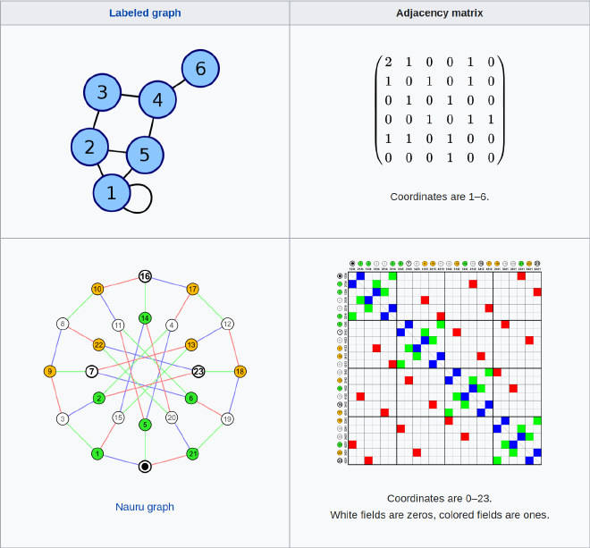

# Visualización de Redes y Árboles

En esta unidad aprenderemos técnicas de visualización de redes y árboles, dos estructuras de datos importantes que permiten modelar fenómenos complejos, ya que contienen relaciones entre elementos. Asimismo, visualizar una red o un árbol no es fácil debido a esa complejidad inherente en los datos.

Una red se define por dos tipos de elementos: sus nodos o vértices (_nodes_ o _vertex_), que representan ítems, elementos, personas, y demases; y sus aristas o enlaces (_edges_ o _links_), que representan relaciones entre nodos. Por tanto, la especificación de una red consiste en definir qué es un nodo y cómo dos nodos se relacionan. Por ejemplo:

*   Una red de personas, donde dos personas están conectadas si:
    *   Son amigas en una red social.
    *   Dan “me gusta” a las mismas páginas.
    *   Han visitado los mismos lugares.
    *   Colaboran para realizar un trabajo (ejemplo: colaboración musical, científica, etc.).
    *   Una ha contagiado a la otra de COVID-19.
*   Una red de lugares, donde dos lugares están conectados si:
    *   Alguien va desde uno de ellos hasta el otro.
    *   Tienen el mismo uso de suelo, o proveen los mismos servicios.
*   Una red de productos, donde dos productos están conectados si:
    *   Son producidos por la misma entidad (proveedor, ciudad, región, país, etc.).
    *   Los compra la misma persona.
    *   Comparten ingredientes o composición.
*   Una red cerebral, dos neuronas están conectadas si se activan al mismo tiempo frente a un estímulo.

El siguiente ejemplo muestra parcialmente una red de trazado de contactos de COVID, de una [paciente que contagió a cientos de personas en Corea del Sur](https://graphics.reuters.com/CHINA-HEALTH-SOUTHKOREA-CLUSTERS/0100B5G33SB/index.html):

Trazado de Contactos COVID-19. Fuente: REUTERS.

Esta visualización enseña las relaciones entre algunos contactos, mostrando cómo se contagió el virus de una persona a otra, y cuál era el tamaño de la comunidad susceptible de infectarse para cada contagiado. Es una visualización parcial, puesto que no muestra todas las conexiones de la red: en el caso de la paciente 31, sabemos que hay más de mil contactos involucrados, pero no sabemos como se relacionan entre sí. Es una muestra de cómo trabajar con redes y visualizarlas es un desafío, puesto que suelen tener una cantidad considerable de nodos y aristas. Además no suelen tener atributos que podamos codificar directamente, a excepción de nodos o aristas con datos geográficos. Ahora bien, eso no es necesariamente un problema, ya que las tareas que se efectúan visualizando redes son distintas a las que vimos en las unidades anteriores. Estas tareas nos permitirán comprender la topología de la red: ¿cuál es el proceso que generó esta red?; su estructura: ¿cuál es el camino desde un nodo hasta otro?¿cuántas comunidades contiene?, o en el caso de un árbol, ¿cuál es su profundidad?¿cómo varía ésta en las distintas ramas del árbol?

Un dataset emblemático en la ciencia de redes es el [Club de Karate de Zachary](https://en.wikipedia.org/wiki/Zachary%27s_karate_club). Zachary es un investigador que documentó la red social de un club de Karate durante tres años. En medio de su investigación, el administrador del club y el _sensei_ tuvieron un problema que disolvió el _dojo_. ¿Qué harían les estudiantes del club?¿Seguirían a su maestro, al administrador, o abandonarían el club? Zachary predijo correctamente todas las decisiones de los miembros del club, con excepción de una persona, utilizando análisis de redes. Así luce la red:

Club de Karate de Zachary. Fuente: Wikipedia.

Cada nodo es una persona. ¿Qué observan en esta red? El color de los nodos nos ayuda a interpretar: hay dos comunidades que reflejan quiénes se quedaron en el dojo y quiénes no. No es coincidencia que la densidad de conexiones explique este fenómeno — quedarse (o no) en el dojo es una decisión social, un fenómeno bien modelado por estas estructuras.

La siguiente red muestra como luce una red de conceptos en Wikipedia, [construida en función de los clics que hacen les visitantes del sitio](https://wikimediafoundation.org/news/2018/01/18/on-that-net-neutrality-clickstream-diagram/). Quienes visitan el artículo de _neutralidad en la red_, ¿hacia dónde siguen leyendo?¿desde dónde llegan a ese artículo?¿cuál es la temática alrededor de ese artículo?

Wikipedia Clickstream del artículo Neutralidad en la Red, en inglés.

Ahora bien, en esta introducción hemos hablado de redes, pero la unidad es de redes **y** árboles. Si recuerdan nuestra unidad de abstracción de datos, sabrán que todo árbol es una red, pero no toda red es un árbol. Esto se debe a que los árboles tienen una estructura jerárquica, con un nodo raíz. Esto puede facilitar la visualización o incluso habilitar metáforas visuales. El siguiente ejemplo toma el [nombre de árbol de manera literal para visualizar la relación entre las lenguas indoeuropeas](https://www.sssscomic.com/comic.php?page=196):

Árbol de lenguas en el mundo. Fuente: Stand Still Stay Silent.

En esta infografía es posible ver como a partir de la raíz de lenguas indoeuropeas se separan las lenguas indo-iranesas y europeas. Luego se ramifican los lenguajes que conocemos, con sus respectivas variaciones. El español (castellano) se encuentra en la rama de las lenguas romance.

Si quieren profundizar sobre el uso de redes para estructurar y modelar conocimiento, 
y de su uso en visualización, entonces les recomiendo la siguiente charla de Manuel Lima. 
Manuel nos cuenta de la complejidad y las redes de manera visual. Es fascinante e inspiradora:

  <iframe src="https://www.youtube.com/embed/BQZKs75RMqM" style="position: absolute; top: 0; left: 0; width: 100%; height: 100%; border:0;" allowfullscreen="" title="YouTube Video"></iframe>

El resto de la unidad está estructurada de la misma manera que las unidades anteriores: revisaremos técnicas de visualización de redes y comentaremos para qué tareas son efectivas.

## Node-Link Diagrams 

La visualización del Club de Karate es del tipo nodo-arista o `node_link`. Es la manera tradicional de representar una red, con nodos visualizados con una marca circular o con símbolos, y con las aristas representadas con marcas de líneas que unen sus nodos correspondientes. Estas líneas pueden ser decoradas con flechas, para indicar la dirección de la relación (si es que no es bidireccional), y no tienen por qué ser rectas, pueden ser curvas y seguir caminos.

En las técnicas `node_link` la visualización contiene un paso previo de organización de nodos y aristas. Este preproceso calcula una posición para los nodos y un recorrido para las aristas de tal modo que se cumpla alguna condición basada en la conectividad y en los atributos de los nodos, o también en restricciones geométricas (por ej., los nodos deben estar a una distancia promedio específica, o estar organizados en un círculo). En la mayoría de los casos, la posición se da en un espacio 2D, pero también puede ser 3D.

La técnica `force_directed_placement` extiende `node_link` a través del cálculo de las posiciones de los nodos utilizando fuerzas de repulsión. Imaginen que cada arista de la red es un resorte, de modo que al disponer los nodos de manera aleatoria en el espacio, algunos resortes estarán comprimidos y otros estarán estirados. Esto provoca que cada resorte tire o empuje a sus nodos; el cálculo de las fuerzas ejercidas por todas las aristas busca encontrar la posición de los nodos que minimice la tensión en ellas. El siguiente ejemplo muestra una red visualizada así:

Ejemplo de Force-Directed Placement. Fuente: Mike Bostock.

El ejemplo muestra que podemos utilizar canales en los nodos y en las aristas para expresar atributos de éstos: podemos utilizar color y tamaño en los nodos, y color y grosor en las aristas.

Una visualización `node_link` (y por tanto, `force_directed_placement`) permite explorar la topología de la red, identificar caminos, y encontrar nodos específicos debido a su conectividad o a sus características. En términos de escalabilidad, puede contener decenas o cientos de nodos, pero manteniendo una relación de densidad nodo/arista: `E < 4N`. De otro modo, podemos tener el problema de las bolas de pelo o _hairballs_, es decir, una visualización que muestra tanto que se vuelve inentendible.

Consideren que la posición de los nodos en esta visualización es un dato **derivado**. No codifica atributos de los nodos, por el contrario, es ajustada por la visualización en pos de la estética. Esto implica que la posición, la proximidad de los nodos o el largo de una arista **no siempre tiene significado**. Más bien son artefactos del algoritmo que derivó los datos. Debemos interpretar esta visualización con cuidado, ya que podríamos ver una estructura en los datos que quizás no esté presente.

Existe una extensión llamada `sfdp`, que realiza un `force_directed_placement` multinivel: deriva de la red una jerarquía de clusters, y ejecuta `force_directed_placement` en cada nivel en vez de la red completa, separando el problema de calcular la organización de toda la red en organizaciones más pequeñas. Esto hace que la visualización sea más escalable en términos de cómputo, permitiendo visualizar 1K nodos y 10K aristas en un tiempo razonable. La apariencia de esta técnica no es _tan_ distinta de `force_directed_placement`:

Multilevel Graph Drawing with sfdp. Fuente: Yifan Hu, Efficient and high quality force-directed graph drawing.

En las clases prácticas veremos como implementar estas visualizaciones en Python. Ahora bien, existe el software [Gephi](http://www.gephi.org) que se define como “el Photoshop de las redes.” Tiene motivos para hacerlo, puesto que permite cargar datos en muchos formatos, incluyendo CSV, y crear o manipular redes en estilo `node_link` con múltiples métodos de organización, incluyendo los que hemos mencionado aquí. El programa luce así:

Fuente: Gephi.org en Wikipedia.

Además de la visualización en sí misma, Gephi permite estimar comunidades, métricas de nodos y aristas, realizar animaciones, conectarse con bases de datos, entre otras características. ¡Es un buen punto de partida para experimentar con redes!

## Matriz de Adyacencia 

Otra manera tradicional de visualizar redes es la matriz de adyacencia o `adjacency_matrix`, una visualización que utiliza la misma codificación visual que el `heatmap` (ver unidad de Visualización de Tablas). En este caso, la marca de cada arista es un cuadro, una celda de la matriz, y su color (o la ausencia de éste) codifica si hay una relación entre los nodo representados en la fila y columna correspondientes. La codificación puede ser binaria (hay o no hay relación), o cuantativa (la relación tiene un peso). La `adjacency_matrix` es también (primero es esto, de hecho) una estructura de datos para almacenar grafos. Un ejemplo de esta estructura es el siguiente:

Matrices de Adyacencia. Fuente: Wikipedia.

Esta configuración implica que la escalabilidad de `adjacency_matrix` es enorme: permite mostrar tantas aristas como píxeles dispongamos en pantalla. Un número máximo recomendado es 1K nodos con 1M de aristas. Estas matrices también pueden ser interactivas. Una operación posible es ordenar las filas y columnas de acuerdo a algún criterio específico.

El siguiente ejemplo muestra una `adjacency_matrix` con datos que hemos visto: la conectividad en Santiago entre comunas para viajes realizados por motivos de salud. Es decir, las comunas de la ciudad son nodos, y dos comunas `A -> B` están conectadas si alguien que vive en la comuna `A` va a la comuna `B` para ir al consultorio, al hospital, a una consulta médica o dental, entre otras:

Ejemplo de Matriz de Adjacencia de viajes, o Matriz Origen-Destino. Fuente: Eduardo Graells-Garrido.

Observamos que la matriz no es densa, y que la mayoría de los viajes se realizan dentro de una misma comuna (una explicación es la disponibilidad de consultorios en todas las comunas); que hay agrupaciones de comunas que van a la misma comuna dentro de su mismo sector en la ciudad para viajes fuera de ellas (una explicación es que no todas las comunas tienen hospitales, y que cada hospital cubre varias comunas dentro de un sector –norte, sur, etc.–). Esta última observación la podemos hacer porque la matriz contiene una marca adicional para cada comuna, que indica el sector al que pertenecen utilizando el canal de tono.

Así, vemos que la visualización `adjacency_matrix` permite realizar tareas de identificación de grupos, de encontrar nodos que cumplen con criterios específicos, y de medir la densidad de la red.

## ¿Cuándo elegir Node-Link, Matriz de Adyacencia?¿Puedo usar ambas? 

Para responder la primera pregunta necesitamos enumerar las ventajas de cada visualización.

*   `node_link`: la **topología** es evidente, se pueden ver **caminos**, es **intuitiva**, no necesita entrenar a las personas para ser utilizada.
*   `adjacency_matrix`: es **predecible**, **escalable**, permite **reordenar** y agregar marcas adicionales sin interferir con las marcas de nodos y aristas. A veces se puede ver la topología.

Entonces, dependiendo de cuál de esas ventajas se necesite para la tarea a resolver, se podrá elegir adecuadamente. Un estudio efectuado el 2005 por Ghoniem et. al, titulado _On the readability of graphs using node-link and matrix-based representations: a controlled experiment and statistical analysis_, en la revista Information Visualization, determinó mediante un experimento con personas realizando tareas que `node_link` es mejor para redes pequeñas, y que `adjacency_matrix` es mejor para redes grandes, si es que las tareas **no** son de topología de la red (determinar caminos o estructura).

Podemos ejemplificar la tarea de identificar topología y cómo se diferencia entre ambas visualizaciones en este [diagrama de Michael J. McGuffin](http://www.michaelmcguffin.com/courses/vis/):

Fuente: Michael J. McGuffin.

¿Por qué es complicado ver topología en `adjacency_matrix`? En el caso de las comunidades que dan estructura a la red, porque depende estrictamente del orden utilizado para nodos y aristas. Usualmente no es un orden natural (como alfabético o por orden de inserción en la red), sino un dato derivado luego de aplicar un algoritmo de clustering. En el caso de los caminos, porque perdemos la noción de cual arista precede o prosigue a otra: dos aristas cercanas en la red pueden estar en lados opuestos de la matriz.

La segunda pregunta del encabezado se puede responder: ¡sí! Existe una técnica llamada `NodeTrix` que combina lo mejor de ambos mundos: una organizacińo basada en `node_link`, donde cada nodo es en realidad una sub-red representada con un glifo de `adjacency_matrix`:

`NodeTrix` combina ambas técnicas: `node_link` y `adjacency_matrix`. Fuente: Henry et al, NodeTrix: a hybrid visualization of social networks.

Genial, ¿no? Esta visualización puede ser útil cuando nos interesa la estructura de la red, particularmente, los caminos entre una comunidad y otra. Un ejemplo de aplicación de `NodeTrix` visualiza redes cerebrales:

Fuente: Yang et al, Blockwise human brain network visual comparison using NodeTrix representation.

Esta visualización permite conocer la red de cada área del cerebro (con una `adjacency_matrix` por cada área), y también saber como las distintas áreas se relacionan entre sí (`node_link` entre áreas). En el diagrama vemos que el último paso realiza un agrupamiento de aristas entre comunidades. Ésa es la siguiente técnica que veremos.

## Edge Bundling 

¿Qué pasa cuando tenemos demasiadas aristas en una visualización `node_link`? Tendremos la imagen sobrepasada de marcas, incluso llegando al extremo de tener una bola de pelos (_hairball_) que no será útil para resolver nuestras tareas. Una manera de facilitar la visualización es reducir el desorden (_clutter_) causado por el exceso de aristas, no reduciendo la cantidad de éstas, sino agrupándolas (_bundling_). Así, una técnica de `edge_bundling` agrupa aristas que son similares en una red, donde similaridad usualmente se define en función de los nodos que son conectados por las aristas: dos aristas que conectan nodos cercanos entre sí, son similares.

Existen muchas técnicas de `edge_bundling`. Quizás las más ad-hoc al contenido introductorio de este curso son dos: `force_directed_edge_bundling` y `hierarchical_edge_bundling`. La segunda es la técnica pionera, al ser la primera en plantear la idea, sin embargo, la primera es más aplicable a lo que hemos visto. En `force_directed_edge_bundling` se parte de un gráfico `node_link`, con aristas representadas como líneas rectas. El propósito de la técnica es que las aristas que sean similares tengan recorridos cercanos en la visualización, casi como si un elástico las restringiese en sus puntos más cercanos. Así, un algoritmo de esta técnica debe identificar o crear esos puntos cercanos, y manipular la forma geométrica de las aristas para que se agrupen, convirtiéndolas en curvas suaves. La siguiente imagen ilustra un par de técnicas en una red de vuelos entre aeropuertos en los Estados Unidos:

Force Directed Edge Bundling. Fuente: Holten & Van Wijk, Force‐directed edge bundling for graph visualization.

¡Al utilizar estas técnicas la legibilidad de una visualización `node_link` aumenta considerablemente! Sin embargo, debemos tener en cuenta que la agrupación de las aristas sigue un criterio basado en las posiciones de los nodos, que no siempre tienen significado en una visualización `node_link` (en el ejemplo sí lo tienen, puesto que son nodos con posición geográfica). Por tanto, `edge_bundling` en un gráfico `node_link` no habilita nuevas tareas, sino que podría facilitar algunas — ¡no todas! Por ejemplo, es posible que al modificar la forma de las aristas perdamos la noción de camino entre nodos.

La primera aplicación concreta de esta técnica se publicó el año 2006, llamada `hierarchical_edge_bundling`. Tiene el nombre _hierarchical_ porque se aplica principalmente a árboles, o a redes en los que se puede inferir una estructura jerárquica (esto es posible en algunos algoritmos de detección de comunidades o de clustering). La técnica tiene la siguiente apariencia:

Hierarchical Edge Bundling. Fuente: Holten, Hierarchical edge bundles: Visualization of adjacency relations in hierarchical data.

En `hierarchical_edge_bundling` se utiliza una codificación similar a `node_link`. Los nodos se expresan con marcas de círculos o puntos organizados de manera circular, por comunidades. En el ejemplo, se muestra la red de código fuente de un _framework_, de modo que existen componentes (comunidades) dentro de macro-componentes, y todas las macro-componentes pertenecen al mismo framework. Los nodos son conectados entre sí con aristas, como en `node_link`, sin embargo estas aristas no son líneas rectas, sino que son curvas siguen el camino jerárquico: imaginen que existen círculos internos en la visualización, uno por cada nivel de jerarquía, hasta llegar al centro del círculo, que contiene la raíz de ésta. Cada arista sigue un camino que la acerca a los nodos de la jerarquía que marcan el camino desde un nodo a otro. Para ejemplificar veamos una red pequeña, el genoma del gusano [C. elegans](https://es.wikipedia.org/wiki/Caenorhabditis_elegans):

Red del genoma de un gusano. Fuente: graph-tool.

Este genoma no tiene una jerarquía de comunidades en sus nodos, pero ésta puede ser inferida. La biblioteca de Python [`graph-tool`](https://graph-tool.skewed.de/static/doc/demos/inference/inference.html) toma una red e infiere dicha estructura. Así, los nodos están dispuestos de acuerdo a la comunidad a la que pertenecen, y la red jerárquica de comunidades aparece desplegada como líneas celestes al interior del círculo. Como ven, cuando un gen se relaciona con otro, la curva que los une se mueve a través de la jerarquía — la jerarquía es el camino a seguir de cada arista. Las aristas, entonces, son agrupadas implícitamente: más que definir cómo una arista es similar a otra, dos aristas que siguen el mismo camino jerárquico serán cercanas en la visualización.

En términos de implementación, cada arista es una curva [B-Spline](https://es.wikipedia.org/wiki/B-spline) cuyos puntos de control son los nodos de la jerarquía (organizados dentro del círculo utilizando un método radial para `node_link`).

## Arc Diagram

La técnica `arc_diagram` puede ser similar a `node_link`, en tanto los nodos se posicionan en una línea recta, y las aristas son arcos sobre o bajo esta línea, dispuestos de acuerdo a algún criterio (como orden temporal, o inferido utilizando un algoritmo). Un ejemplo de esta visualización es [Edge Maps](http://mariandoerk.de/edgemaps/), que muestra relaciones de influencia entre personajes filosóficos:

Edge Maps, una visualización estilo `arc_diagram`. Fuente: Marian Dörk.

Como vemos en la imagen, las personas están organizadas temporalmente. En este caso, esto implica que las relaciones de haberse inspirado en las ideas de otras personas van hacia atrás, y por tanto se muestran abajo de los nodos, mientras que las relaciones de influir a otras personas van hacia adelante en el tiempo, apareciendo en la parte superior del gráfico.

Este tipo de visualización es menos escalable que `node_link` debido a la restricción de espacio de los nodos, que solamente se pueden organizar en una línea recta. También podría dificultar ver caminos entre nodos, pero eso dependerá de la interacción y de los canales utilizados en las aristas. Ahora bien, permite encontrar patrones relacionados con los atributos de los nodos de manera más directa que en `node_link`.

En `arc_diagram` también podemos utilizar un glifo como nodo. El siguiente ejemplo de [Gastón Sánchez](http://www.gastonsanchez.com/visually-enforced/got-plot/crunching-data/2013/02/03/Star-Wars-Arc-Diagram/) muestra relaciones de personajes en Star Wars, donde cada nodo además de incorporar el nombre del o de la personaje correspondiente, muestra un gráfico de barras con sus palabras más usadas en los diálogos de la película:

Star Wars `arc_diagram`. Fuente: Gastón Sánchez.

Al ser una técnica que funciona sobre una línea recta, es posible complementar una `adjacency_matrix` con `arc_diagram` en sus dos ejes. En algunas ocasiones, es posible que esto facilite hacer tareas difíciles en `adjacency_matrix`, como seguir caminos.

## Hive Plot 

La técnica `hive_plot` busca resolver el problema de la falta de estructura (o una estructura artificial basada en criterios estéticos de un algoritmo) en los diagramas tradicionales, al definir ejes estructurales donde posicionar los nodos. La especificación de la técnica es la siguiente:

Diseño de `hive_plot`. Fuente: Krzywinski et al, Hive plots—rational approach to visualizing networks.

Es una idea similar a `parallel_coordinates` para visualizar tablas, pero para redes. Las tareas relacionadas con estructura y topología de la red pueden facilitarse en función de la definición de los ejes de esta visualización. Los nodos pueden repetirse entre ejes, dependiendo de lo que codifique cada uno de ellos. Al igual que `parallel_coordinates` es una técnica que requiere entrenamiento para ser utilizada. Eso no es una limitante, pero sí es algo que debe ser considerado. La siguiente imagen ilustra la diferencia entre `node_link` y `hive_plot`:

Diferencia entre `node_link` y `hive_plot`. Fuente: Krzywinski et al.

Una tarea que se vuelve posible con esta visualización, que no era factible con las vistas anteriormente, es la comparación de redes. Si dos redes difieren en sus nodos o aristas, las visualizaciones anteriores serán irremediablemente distintas en su estructura (por ej., teniendo menos filas y columnas en la `adjacency_matrix`, o teniendo una organización diferente en `node_link` debido a su naturaleza algorítmica). En cambio, como `hive_plot` define ejes estructurales, lo que comparamos al ver dos (o más) instancias de esta visualización es cómo distintas redes presentan (o no) esa estructura específica.

## Radial Node-Link 

La técnica `radial_node_link` es una instancia específica de `node_link` para árboles. Utiliza la misma codificación visual, pero la organización y orientación de los nodos está restringida por la estructura de la red. El nodo central es la raíz del árbol, y desde allí se ramifican las aristas a cada nivel de profundidad del árbol. Luce así:

Ejemplo de `radial_node_link`. Fuente: Mike Bostock.

Además de las tareas y especificaciones de escalabilidad de `node_link`, al utilizar `radial_node_link` se vuelve posible realizar otras operaciones, como saber si dos nodos son hermanos o no, debido a la proximidad angular de los nodos, o bien saber el nivel o profundidad a la que se encuentra un nodo, ya que este atributo está codificado por la distancia hacia el centro (raíz) del árbol.

## Treemap

La visualización `treemap` también está orientada a árboles. Sin embargo, presenta un esquema distinto a las visualizaciones anteriores, ya que es una técnica de estilo _space filling_, es decir, llena todo el espacio de la visualización. Es una visualización recursiva que utiliza la estructura de la red para dividir el espacio, que utiliza rectángulos como marca para cada nodo. Primero, la raíz ocupa todo el espacio rectangular. Luego, cada uno de los nodos es representando con un rectángulo cuyo tamaño es proporcional a la cantidad de nodos que descienden de él (o de un valor total calculado para todos sus nodos descendientes a partir de un atributo cuantitativo). Cada uno de esos rectángulos es dividido siguiendo el mismo esquema. Una manera de ejemplificar esto es a través del sistema [TreeSize](https://en.wikipedia.org/wiki/TreeSize), que visualiza el contenido de un dispositivo de almacenamiento:

Ejemplo de `treemap` en el sistema TreeSize. Fuente: Wikipedia.

Observamos que la raíz del disco (`C:\`) es un rectángulo que contiene otros directorios (rectángulos), cuyo tamaño es proporcional al espacio que ocupa cada directorio en el disco. En este caso el canal de color utiliza la saturación y la luminosidad para codificar la profundidad de cada directorio en el disco.

Las tareas que se pueden realizar con un `treemap` incluyen explorar las distribuciones de los atributos de los nodos y consultar atributos de los nodos hoja (los últimos en la profundidad), y cuantificar relaciones parte-de-un-todo. Su escalabilidad dependerá del tamaño de la visualización a utilizar, pero, al igual que `adjacency_matrix`, puede alcanzar el millón de hojas si queremos que cada hoja sea representada con un píxel. Su limitante es que el tamaño de los rectángulos solo es una aproximación de los valores reales asociados a cada hoja, ya que no siempre es posible dividir el espacio de manera exacta utilizando rectángulos.

Esta técnica de visualización está implementada en todos los sistemas de visualización comercial y BI. Es directa de utilizar y de interactuar, y su codificación visual no es compleja. Dependiendo de los canales utilizados, puede tener un alto valor estético también. Por tanto, es un buen punto de partida para explorar datos que se puedan estructurar en árboles. Pueden ver una página con la [historia de los treemaps y sus variantes](http://www.cs.umd.edu/hcil/treemap-history/index.shtml) preparada por su creador, Ben Shneiderman.

## Voronoi TreeMap 

La técnica `voronoi_treemap` extiende la propuesta de `treemap` a áreas flexibles en vez de rectángulos, lo que consigue una mejor relación entre el tamaño asignado a un área y el valor codificado por ella. Como su nombre lo dice, utiliza [diagramas de Voronoi](https://es.wikipedia.org/wiki/Pol%C3%ADgonos_de_Thiessen) para lograr ese efecto. Un ejemplo que visualiza un repositorio de código luce así:

Ejemplo de `voronoi_treemap` para un repositorio de código. Fuente: Balzer et al, Voronoi treemaps for the visualization of software metrics.

Como vemos, la apariencia es más orgánica y flexible que en el `treemap` tradicional, aunque es también puede perjudicar la comprensión de la visualización. Sin embargo, ésa es también la fortaleza de esta visualización. Al ser adaptable a cualquier forma los podemos utilizar dentro de otras visualizaciones, por ejemplo con datos geográficos. El New York Times realizó una visualización que convirtió las tasas de migración interna e internacional en cada estado en los Estados Unidos en una estructura de árbol, donde la raíz es el país, los nodos del primer nivel son los estados, y los nodos del segundo nivel son los orígenes de la población de cada estado. Por tanto, es posible construir una visualización mixta:

_Mapping Migration in the US_, un ejemplo de visualización mixta de mapas y `voronoi_treemap`. Fuente: New York Times.

La visualización permite ver para cada estado cuál es la distribución de migrantes (o locales), es decir, tareas parte-de-un-todo, que son fácilmente comparables entre estados debido al uso del canal de color para mostrar el atributo categórico de origen.

A pesar de que la escabilidad de `voronoi_treemap` es alta, sus usos más efectivos suelen ser aquellos donde la red no es grande, como el ejemplo del New York Times, o en árboles geográficos con resultados de votación. Aún así, es una visualización que tiene buen potencial estético y comunicativo.

## Fin de Unidad 

En esta unidad hemos visto técnicas de visualización para redes. A pesar de que las redes son datos cada día más presentes, sobretodo debido a la disponibilidad de trazas digitales, el abanico de técnicas de visualización es menos amplio que para otros tipos de dataset. Visualizar redes de manera efectiva plantea desafíos importantes, tanto de escalabilidad, de análisis de los datos, y también de interpretabilidad y legibilidad en la visualización. Vale la pena enfrentar esos desafíos, ya que los fenómenos que podemos trabajar y analizar a través de las redes no son transferibles a otros tipos de dataset. Las necesidades de la sociedad hoy son complejas, y la visualización es una manera de poner esa complejidad ante nuestros ojos y poder interactuar con ella, sumergirnos en su profundidad, y extraer conocimiento que nos ayude a resolver los problemas actuales que nos aquejan.

## Lecturas Recomendadas 

*   Hadlak, Steffen, Heidrun Schumann, and Hans-Jörg Schulz. [_A Survey of Multi-faceted Graph Visualization_](https://www.researchgate.net/profile/Hans-Joerg_Schulz/publication/274633015_A_Survey_of_Multi-faceted_Graph_Visualization/links/5523cb010cf2b351d9c33836.pdf). In EuroVis (STARs), 2015.