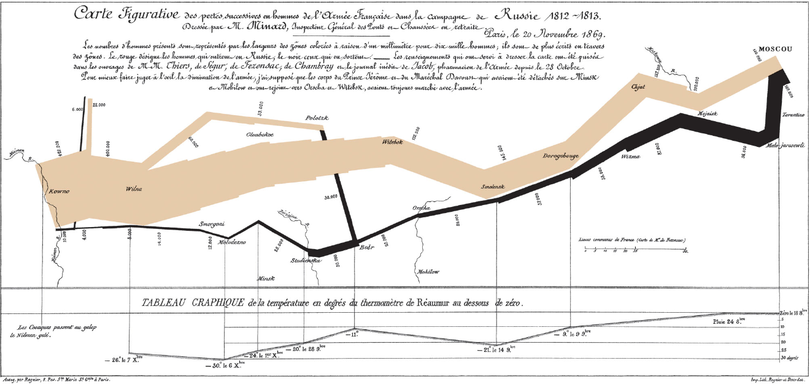

# Exhibición de Visualizaciones

En esta página hay una recolección de visualizaciones interesantes y proyectos de/que usan visualización del Instituto de Data Science de la Universidad del Desarrollo.

El propósito de esta página es entregar experiencias, ideas y potencial proyecto o aplicación en sus proyectos de curso.

## Outbreak Simulation 

```
!\[“Why outbreaks like coronavirus spread exponentially, and how to “flatten
the curve”\](images/coronavirus.gif ““Why outbreaks like coronavirus spread
exponentially, and how to “flatten the curve””)
```

Esta [visualización interactiva que permite simular contagios del coronavirus](https://www.washingtonpost.com/graphics/2020/world/corona-simulator/) ha sido el artículo más visitado del Washington Post (¡en toda su historia!).

## Charles Minard (1869)




Carte figurative des pertes successives en hommes de l’Armée Française dans la campagne de Russie 1812-1813.

Algunos dicen que es el gráfico estadístico más completo en la historia.

## The Image of the City 


Mapas mentales de Boston por Kevin Lynch, ilustrados con lo que la gente imaginaba y recordaba de la ciudad (sus propias abstracciones).

## NameVoyager


Martin Wattenberg y Fernanda Viegas. NameVoyager.

## Sorting Algorithms 


¿Cómo visualizar un proceso? _Sorting Algorithms_ de Mike Bostock. Fuente: [http://bost.ocks.org/mike/algorithms/](http://bost.ocks.org/mike/algorithms/).

## Incidencia de Sarampión en Estados Unidos 


Heatmap de Sarampión por el Wall Street Journal. [http://graphics.wsj.com/infectious-diseases-and-vaccines/](http://graphics.wsj.com/infectious-diseases-and-vaccines/).

## The Bohemian Bookshelf 


The Bohemian Bookshelf de Alice Thudt. ¿Cómo comenzar a navegar en una biblioteca utilizando _touch screens_? [http://www.alicethudt.de/BohemianBookshelf/](http://www.alicethudt.de/BohemianBookshelf/).

## TensorFlow


TensorFlow Playground, para entender cómo aprende y funciona un algoritmo de Deep Learning. [http://playground.tensorflow.org](http://playground.tensorflow.org).

## Data Chile 


Data Chile por Datawheel. [https://es.datachile.io/](https://es.datachile.io/).

## Good City Life 


Mapeando el entramado urbano desde lo sensorial: olores, sonidos, texturas, colores. Proyecto de Daniele Quercia, Rossano Schifanella y Luca Aiello. [http://goodcitylife.org/](http://goodcitylife.org/).

## Discursos Presidenciales 


Visualización de Discursos Presidenciales (y Dictatoriales) por Riva Quiroga. [https://twitter.com/rivaquiroga](https://twitter.com/rivaquiroga).

## Goles de Messi 


Goles de Messi, por Pablo Paladino. [http://palamago.github.io/messi-500/dist/](http://palamago.github.io/messi-500/dist/).

## La Puerta Giratoria del Poder


La Puerta Giratoria del Poder: [http://www.lapuertagiratoria.cl/](http://www.lapuertagiratoria.cl/).

## Migration Waves 


National Geographic visualizó los últimos 50 años de migración en el mundo.

Pueden ver la visualización completa [aquí](https://www.nationalgeographic.com/magazine/2019/08/graphic-shows-past-50-years-of-global-human-migration/?sf215829698=1&sf217104276=1). Finalista de la competencia Malofiej 2020.

## Music Timeline 


Music Timeline del grupo Big Picture de Google. [https://research.google.com/bigpicture/music](https://research.google.com/bigpicture/music).

## Story Lines


¿Cómo representar historias? Un algoritmo y técnica de visualización que partió desde una infografía hecha en el cómic XKCD.

El paper está disponible [aquí](https://ieeexplore.ieee.org/document/7015617/?reload=true&arnumber=7015617).

## Ciclo de Vida de las Ideas


Ciclo de vida de las ideas, por Giorgia Lupi. [http://giorgialupi.com/](http://giorgialupi.com/).

## ¿Quién te rastrea en Internet? 


Visualización por Nadieh Bremer, en el New York Times.

El artículo está disponible [aquí](https://www.nytimes.com/interactive/2019/08/23/opinion/data-internet-privacy-tracking.html)

## Proyecto #cuéntalo


Visualización de testimonios de violencia de género en el hashtag #cuéntalo, por el grupo de Visualización del Barcelona Supercomputing Center. [http://proyectocuentalo.org/](http://proyectocuentalo.org/).

## Iraq’s Bloody Toll


Infografía de Simon Scarr.

## ¿Dónde viven los extranjeros en Chile?


Infografía de La Tercera.

## Sabemos lo que hiciste en el último Sónar 


Proyecto del Barcelona Supercomputing Center, donde registraron las bandas visitadas por los asistentes al festival musical Sónar. [http://www.bsc.es/viz/whatyoudid/about.html](http://www.bsc.es/viz/whatyoudid/about.html).

## Employment and Gender 


Asociación entre ocupaciones y sexo de las personas en los Estados Unidos.

La visualización interactiva está [aquí](https://flowingdata.com/2017/09/11/most-female-and-male-occupations-since-1950/).

## Flujos en Santiago 


De dónde hacia dónde se mueve la gente en Santiago, con datos de la tarjeta Bip!. Con Alonso Astroza para hackathon Abre CL.


De la misma hackathon. Lugares frecuentes de origen y destino para la gente que usa transporte público.

## Discusión de Aborto en Chile 


Cuatro años de discusión sobre el aborto en Chile y Argentina.

Este trabajo se tituló [Every Colour You Are: Stance Prediction and Turnaround in Controversial Issues](https://dl.acm.org/doi/10.1145/3394231.3397907).

## Discusión Des-Centralizada


¿Cómo representar la centralización en Chile? ¿Cómo afecta la centralización el consumo de información? Podemos revertir los efectos de la centralización usando algoritmos y visualización (2014, de mi tesis).

## Retratos de Datos (Data Portraits) 


Data Portraits. ¿Cómo te ves en la Web?

## Matrices Origen-Destino a partir de Telefonía Móvil


Inferencia de viajes en la ciudad. ¿Cuánta gente se mueve de un lado a otro? Proyecto de transferencia tecnológica con Telefónica I+D (2015-2018).

## Pokémon Go en Santiago 


¿Cuál fue el efecto de Pokémon Go en el pulso de la ciudad? [https://epjdatascience.springeropen.com/articles/10.1140/epjds/s13688-017-0119-3](https://epjdatascience.springeropen.com/articles/10.1140/epjds/s13688-017-0119-3).

## Mall Co-visitation 


¿Qué influye en nuestra elección de visitar un mall? Proyecto MallMob (2017-2018), liderado por Leo Ferres y Mariano Beiró (Universidad de Buenos Aires).

## Alcances de esta Exhibición 

Estos proyectos incluyen una fuerte componente de análisis de datos y aprendizaje automático. Son realizados por equipos de personas con años de experiencia en el tema. La idea es motivarlos con el alcance que puede tener la visualización :) Afortunadamente, muchas de las técnicas que se utilizan en estos proyectos están al alcance de nuestras manos a través de las herramientas que veremos en el curso.

¿Quieres colaborar con nosotros? Podemos trabajar contigo en tu proyecto de título, tesis de magíster, estudio dirigido, etc. :) ¡Contáctanos!